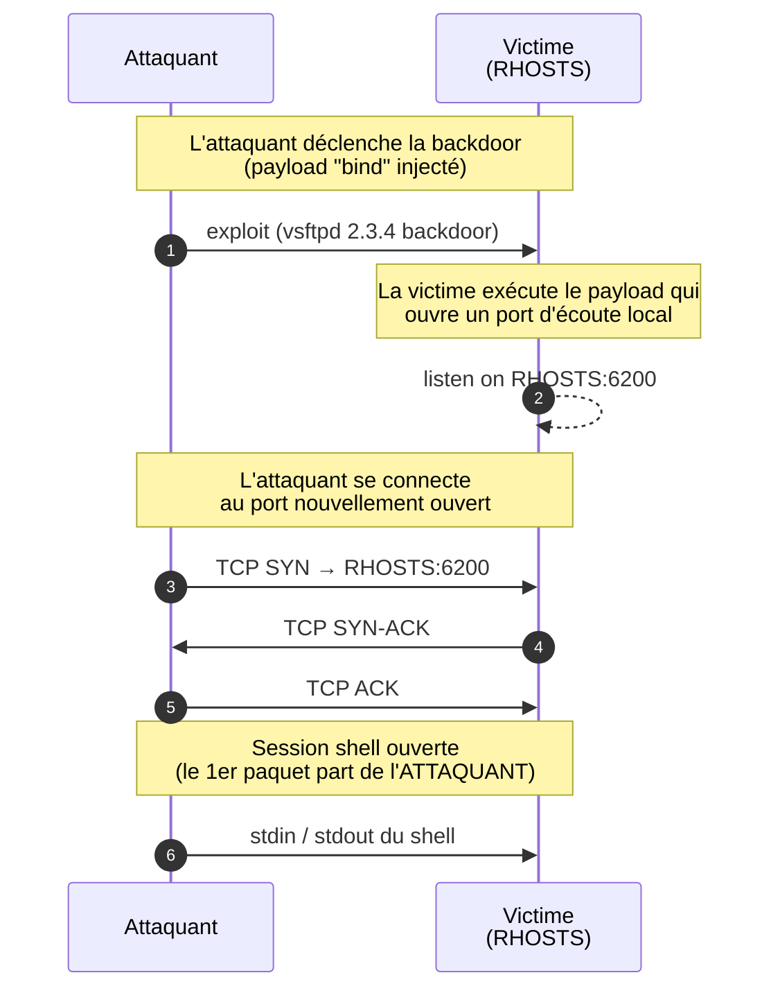
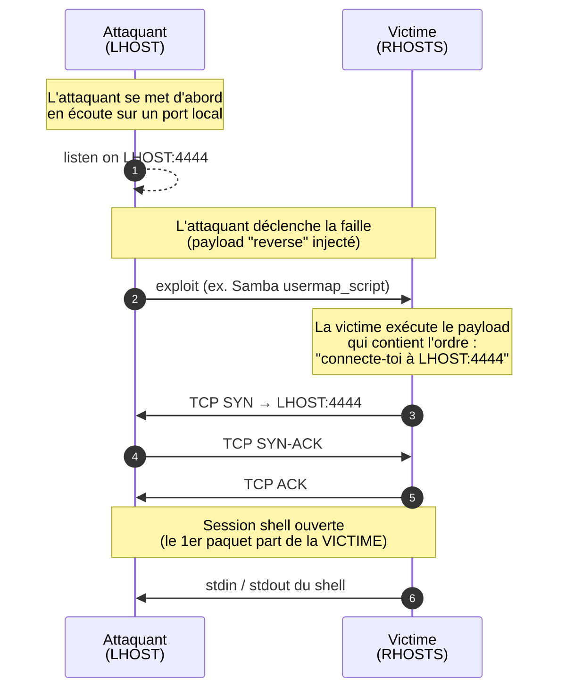

# TP 9 : Introduction à l'Exploitation avec Metasploit

Jusqu'à présent, vous avez appris à analyser des paquets et à manipuler le réseau. Aujourd'hui, nous passons à l'offensive. L'objectif de ce TP est de comprendre comment les vulnérabilités logicielles sont exploitées dans le monde réel pour prendre le contrôle d'une machine distante.

Vous allez utiliser **Metasploit Framework**, l'outil standard de l'industrie pour le test d'intrusion.

---

## 0. Mise en place du Laboratoire

Pour éviter d'attaquer de vraies machines (ce qui est illégal !), nous allons déployer une cible virtuellement vulnérable (Metasploitable 2) directement sur votre machine locale via Docker. Cette étape est à réaliser scrupuleusement avant de commencer.

1. **Installation de Metasploit :** Ouvrez un terminal sur votre VM Ubuntu et exécutez ces commandes :
   ```bash
   curl https://raw.githubusercontent.com/rapid7/metasploit-omnibus/master/config/templates/metasploit-framework-wrappers/msfupdate.erb > msfinstall
   chmod 755 msfinstall
   sudo ./msfinstall
   ```
   L'installation télécharge environ 1 Go et prend 5 à 10 minutes — laissez tourner. Le tout premier lancement de `msfconsole` initialise une base de données et peut prendre 1 à 2 minutes supplémentaires : c'est normal, ne fermez pas la fenêtre.
2. **Démarrage de la cible :** Lancez le conteneur vulnérable en tâche de fond. Attention : cette image ne démarre pas ses services automatiquement, il faut le lui demander explicitement avec `services.sh`.
   ```bash
   sudo docker run --name victim -d tleemcjr/metasploitable2:latest \
     sh -c "/bin/services.sh && tail -f /dev/null"
   ```
   Patientez quelques secondes, puis vérifiez que les services tournent bien à l'intérieur du conteneur :
   ```bash
   sleep 5
   sudo docker exec victim netstat -tln 2>/dev/null | grep LISTEN
   ```
   Vous devez voir au minimum les ports 21, 22, 80, 139, 445 et 3306 en écoute. Si la liste est vide, le conteneur n'est pas prêt : attendez encore quelques secondes et recommencez.

3. **Identification des adresses IP :**
   *   **Votre adresse IP (Attaquant) :** Trouvez l'adresse de votre interface `docker0` (généralement `172.17.0.1`) via la commande `ip a`.
   *   **L'adresse IP de la cible :** Exécutez `sudo docker inspect -f '{{range.NetworkSettings.Networks}}{{.IPAddress}}{{end}}' victim`.

> **Notez ces deux adresses IP précieusement, vous en aurez besoin tout au long du TP.**

---

## Partie 1 : La Reconnaissance

Un bon hacker ne frappe jamais au hasard. Il doit d'abord cartographier sa cible.

1.  Utilisez l'outil `nmap` pour scanner votre cible.
2.  **Question :** Quelle option de `nmap` devez-vous utiliser pour découvrir non seulement les ports ouverts, mais aussi la **version exacte** des services qui y tournent ?

    <details><summary>Indice 1 — vous bloquez ?</summary>
    Tapez <code>nmap --help</code> et cherchez la section sur la <em>service/version detection</em>. Une option courte commence par <code>-s</code>.
    </details>

    <details><summary>Indice 2 — toujours bloqué ?</summary>
    L'option à utiliser est <code>-sV</code>. Vous pouvez la combiner avec un scan de tous les ports : <code>nmap -sV -p- &lt;IP&gt;</code> (mais c'est plus lent).
    </details>

    <details><summary>Mon scan dit "Host seems down" ou prend très longtemps</summary>
    Certains conteneurs Docker ne répondent pas au ping ICMP utilisé par défaut par nmap pour la découverte d'hôte. Forcez le scan avec l'option <code>-Pn</code> qui dit à nmap de considérer la cible comme vivante sans la pinger : <code>nmap -sV -Pn &lt;IP&gt;</code>.
    </details>

3.  Analysez le résultat du scan. Parmi tous les services découverts, **lesquels vous semblent les plus "à risque" ?** Notez-en 2 ou 3 et justifiez votre choix (ancienneté apparente du logiciel, type de service, exposition habituelle sur Internet…). Vous y reviendrez peut-être plus tard.

    <details><summary>Indice — comment juger qu'un service est "à risque" ?</summary>
    Quelques pistes : un numéro de version qui semble très ancien (ex. 2.3.x là où on en est à 3.x aujourd'hui), un service de partage de fichiers exposé sur Internet, un service en clair (sans chiffrement) comme telnet ou FTP, un service rarement mis à jour…
    </details>

> **Question de réflexion**
> Pourquoi un attaquant cherche-t-il la **version exacte** d'un service, et pas seulement son nom ? Que se passe-t-il, du point de vue de l'attaquant, si `nmap` ne parvient à identifier qu'un nom sans numéro de version ?

> **Côté défense**
> Si vous étiez l'administrateur de cette machine, quelle information aimeriez-vous **cacher** à `nmap` ? Est-ce vraiment possible ? (Cherchez le terme "banner grabbing".)

---

## Partie 2 : Première compromission (Bind Shell)

Concentrez-vous sur le service tournant sur le **port 21 (FTP)**. Ce service précis a une histoire célèbre : en 2011, quelqu'un a réussi à modifier le code source officiel du projet pour y glisser une "porte dérobée" (backdoor). Si on s'y connecte avec un nom d'utilisateur contenant un smiley `:)`, le serveur ouvre secrètement un port offrant un accès total. Cette backdoor est restée disponible au téléchargement plusieurs jours avant d'être détectée.

Nous allons exploiter cette faille avec Metasploit.

1.  Lancez la console Metasploit en tapant `msfconsole` dans votre terminal.
2.  Utilisez la commande `search` de `msfconsole` pour trouver un module correspondant à la **version exacte** du service FTP que vous avez identifié au scan.
    *   Plusieurs résultats peuvent apparaître. Comment décidez-vous lequel choisir ? Observez les colonnes `Rank` et `Disclosure Date` — que vous apprennent-elles ?

    <details><summary>Indice 1 — quelle requête de recherche ?</summary>
    Tapez simplement <code>search</code> suivi du nom du logiciel <strong>et</strong> de son numéro de version, séparés par un espace. Plus vous êtes précis, moins vous aurez de résultats à trier.
    </details>

    <details><summary>Indice 2 — comment choisir parmi les résultats ?</summary>
    La colonne <code>Rank</code> indique la fiabilité de l'exploit (de <code>excellent</code> à <code>low</code>). Privilégiez les modules de haut rang : ils marchent du premier coup et ne plantent généralement pas la cible. La colonne <code>Disclosure Date</code> indique quand la faille a été rendue publique.
    </details>

3.  Sélectionnez le module pertinent avec la commande `use <chemin_du_module>`.

    <details><summary>Indice — vous pouvez gagner du temps</summary>
    Vous n'avez pas besoin de retaper tout le chemin : <code>use 0</code> sélectionne le premier résultat de votre dernière recherche.
    </details>
4.  Tapez la commande `show options`. Cette commande est votre meilleure amie : elle liste les paramètres nécessaires pour lancer l'attaque.
5.  **Analyse :** Observez la colonne `Required`. Quel paramètre obligatoire est actuellement vide ?
6.  Configurez ce paramètre avec la commande `set <NOM_DU_PARAMETRE> <IP_DE_LA_CIBLE>`.
7.  Lancez l'attaque avec la commande `run`.

> **Question de réflexion**
> Le module que vous venez d'utiliser porte le mot `backdoor`, et non `exploit` au sens classique du terme. Quelle est la différence conceptuelle entre **exploiter un bug** et **utiliser une backdoor** ? Cette faille est-elle une erreur de programmation ou un acte volontaire ? Et qu'est-ce que cela vous apprend sur les risques liés à la **chaîne d'approvisionnement logicielle** (supply chain) — c'est-à-dire au fait que vous téléchargez et exécutez du code écrit par d'autres ?

Si tout se passe bien, votre invite de commande change. Vous n'êtes plus sur votre machine, mais sur la cible ! (C'est ce qu'on appelle un **Bind Shell**.)

Voici le flux complet d'un bind shell, étape par étape :



> **Le point clé à retenir :** dans un bind shell, **c'est l'attaquant qui initie la connexion TCP vers la victime**. Du point de vue d'un pare-feu d'entreprise, cela ressemble à une connexion entrante non sollicitée — exactement ce que le pare-feu est conçu pour bloquer. Retenez bien ce sens : il sera le contraire de celui que vous verrez en Partie 3.

**Mission : prouvez votre niveau de privilèges.**
*   Identifiez d'abord sous quel compte vous êtes connecté.

    <details><summary>Indice</summary>
    La commande Linux qui répond à "qui suis-je ?" est… exactement cela, en anglais et en un seul mot.
    </details>

*   Puis prouvez que vous avez les droits d'administrateur en **lisant un fichier qui n'est normalement accessible qu'à `root`**. À vous de trouver lequel : pensez aux fichiers sensibles vus en cours de système d'exploitation (où sont stockés les hachages des mots de passe sur un Linux moderne ?).

    <details><summary>Indice 1</summary>
    Sur les Linux modernes, les hachages des mots de passe ne sont plus dans <code>/etc/passwd</code> (qui est lisible par tout le monde) mais dans un autre fichier du même dossier, dont le nom évoque une "ombre".
    </details>

    <details><summary>Indice 2</summary>
    Le fichier est <code>/etc/shadow</code>. Lisez-le avec <code>cat</code>.
    </details>

Appuyez ensuite sur `Ctrl+C` et confirmez avec `y` pour quitter la session et revenir à Metasploit.

> **Côté défense**
> Vous venez de prendre le contrôle complet de cette machine en quelques commandes. Pourtant, **aucune ligne de code de vsftpd n'avait besoin d'être réécrite** pour empêcher cette attaque. Quelle action **simple** un administrateur système aurait-il pu entreprendre pour rendre votre attaque impossible ? Pourquoi cette action si simple est-elle, en pratique, si souvent négligée dans les vraies entreprises ?

---

## Partie 3 : Contourner les défenses (Reverse Shell)

Le *Bind Shell* de la Partie 2 fonctionne… dans notre laboratoire. Mais dans un vrai réseau d'entreprise, il a très peu de chances de marcher. Vous allez attaquer une autre faille — sur le service Samba cette fois — et vous allez voir que **Metasploit a anticipé le problème pour vous**.

1.  Revenez à votre scan Nmap initial. Identifiez le service de partage de fichiers **Samba** (ports 139/445).
2.  Dans Metasploit, cherchez la faille nommée `usermap_script` et sélectionnez-la (`search ...` puis `use ...`).

    <details><summary>Indice</summary>
    <code>search usermap_script</code> puis <code>use 0</code> (ou le chemin complet du module renvoyé).
    </details>

3.  Au moment où vous tapez `use`, lisez attentivement le message qui s'affiche : Metasploit vous annonce qu'il a **automatiquement sélectionné un payload par défaut**. Notez son nom — vous allez en avoir besoin dans un instant.

> **Question de réflexion — l'évolution des défauts**
> Le payload par défaut sélectionné par Metasploit pour ce module contient le mot `reverse`. Pour vsftpd (Partie 2), aucun payload n'était sélectionné par défaut, et le résultat naturel était un *bind shell* (l'attaquant se connecte au port 6200 ouvert par la backdoor sur la victime).
>
> Pour Samba en revanche, Metasploit a fait le choix d'un **reverse shell par défaut**. Pourquoi, à votre avis, les versions modernes de Metasploit privilégient-elles un reverse plutôt qu'un bind ? Quelle évolution du **paysage réseau de ces 20 dernières années** cette décision reflète-t-elle ? (Pensez aux pare-feux d'entreprise, aux NAT chez les particuliers, au cloud…)

Pour comprendre ce que va faire ce payload, voici comment fonctionne un **Reverse Shell** : plutôt que d'attendre que la victime ouvre un port pour nous (ce qu'un pare-feu bloquerait dans la vraie vie), c'est **nous qui nous mettons en écoute**, et c'est la victime qui vient se connecter à nous. Le trafic *sortant* d'une entreprise est presque toujours autorisé — d'où l'efficacité du procédé.

Voici le flux complet d'un reverse shell, étape par étape :



> **Le point clé à retenir :** dans un reverse shell, **le tout premier paquet TCP (`SYN`) part de la victime vers l'attaquant**, jamais l'inverse. C'est exactement ce qui permet de traverser un pare-feu qui bloque les connexions entrantes : du point de vue du pare-feu, c'est "juste" un utilisateur interne qui consulte un site externe.

4.  Tapez maintenant `show options`. Comparez avec ce que vous aviez en Partie 2 : une nouvelle section **"Payload options"** est apparue, et elle contient un paramètre `LHOST`.
5.  **Réflexion :** Pourquoi `LHOST` n'apparaissait-il pas dans la Partie 2, et apparaît-il ici ? Que représente-t-il, et que devez-vous y mettre ?

    <details><summary>Indice — quelle valeur pour LHOST ?</summary>
    <code>LHOST</code> = "Local Host" = l'adresse à laquelle la victime doit se connecter pour vous joindre. Metasploit a probablement déjà pré-rempli ce champ pour vous, en détectant l'IP de votre interface <code>docker0</code> (souvent <code>172.17.0.1</code>). Vérifiez la valeur affichée : si elle correspond bien à l'IP que vous avez notée à l'étape 0 du TP, vous n'avez rien à changer. Sinon, corrigez-la avec <code>set LHOST &lt;votre_IP&gt;</code>.
    </details>

6.  Configurez `RHOSTS`, vérifiez que `LHOST` est correct, et lancez l'attaque (`run`).

> **Exercice de comparaison**
> Vous avez maintenant **les deux diagrammes** sous les yeux : Bind Shell (Partie 2) et Reverse Shell (Partie 3). Sur une feuille de papier, recopiez schématiquement les deux scénarios côte à côte, puis ajoutez sur chacun un **pare-feu d'entreprise** placé entre l'attaquant (à l'extérieur du réseau) et la victime (à l'intérieur). Ce pare-feu est configuré pour **bloquer tout trafic entrant non sollicité**, mais laisse passer tout le trafic sortant.
>
> Répondez ensuite à ces questions, en vous appuyant sur vos schémas :
> 1. Sur quel scénario le **premier paquet `SYN`** est-il bloqué par le pare-feu ? Pourquoi ?
> 2. Sur l'autre scénario, pourquoi le pare-feu laisse-t-il passer la connexion alors qu'elle aboutit, *in fine*, à donner le contrôle de la machine interne à un attaquant externe ?
> 3. Imaginez maintenant que le pare-feu, en plus de bloquer l'entrant, ne laisse sortir que le trafic vers les ports 80 et 443 (HTTP/HTTPS). Que devrait faire l'attaquant pour que son reverse shell continue de passer ?

> **Exercice optionnel — forcer un bind shell pour comparer**
> Vous venez d'utiliser le payload reverse par défaut. Et si vous *forciez* manuellement un bind shell sur cette même attaque Samba, pour reproduire le scénario "à l'ancienne" de la Partie 2 ? Essayez :
>
> ```
> set payload cmd/unix/bind_perl
> show options
> run
> ```
>
> Observez attentivement la ligne `Command shell session N opened (... -> ...)`. Comparez le **sens de la flèche** avec celui que vous aviez obtenu juste avant avec le payload reverse. Que constatez-vous ? Lequel des deux scénarios traverserait un pare-feu d'entreprise classique ? (Pour revenir au reverse, refaites `set payload cmd/unix/reverse_netcat`.)

> **Observation :** Lisez attentivement les lignes affichées lors du succès de l'attaque. Remarquez le sens de la connexion (`IP:port -> IP:port`) : cela confirme qu'il s'agit bien d'un Reverse Shell.

---

## Partie 4 : Post-exploitation — Pillage et signature

Vous avez de nouveau les droits d'administrateur (root) sur la machine cible. Un vrai attaquant ne se contente jamais d'obtenir un shell : il **explore**, **collecte**, puis (parfois) **laisse une trace**. C'est la phase de *post-exploitation*.

### 4.1 Mission de reconnaissance interne

Avant de laisser votre signature, comportez-vous comme un véritable attaquant : **explorez la machine** et collectez des informations qui pourraient être réutilisées pour aller plus loin (rebondir vers d'autres systèmes, vendre des données, etc.).

Trouvez et notez dans votre rapport :

1.  Le **nom d'hôte** de la machine et la version exacte du système d'exploitation.

    <details><summary>Indice</summary>
    Les commandes <code>hostname</code> et <code>uname -a</code> sont vos amies. Pour la distribution exacte, regardez aussi <code>/etc/issue</code> ou <code>/etc/*release*</code>.
    </details>

2.  La liste des **utilisateurs ayant un shell de connexion valide** (regardez le fichier qui décrit les comptes utilisateurs sous Linux). Combien y en a-t-il ? Lesquels vous semblent intéressants ?

    <details><summary>Indice 1</summary>
    Le fichier qui liste tous les comptes utilisateurs Linux est <code>/etc/passwd</code>. Lisez-le.
    </details>

    <details><summary>Indice 2</summary>
    Chaque ligne se termine par le shell de l'utilisateur. Les comptes système ont en général <code>/bin/false</code> ou <code>/usr/sbin/nologin</code>. Les vrais utilisateurs ont <code>/bin/bash</code> (ou similaire). Vous pouvez les filtrer avec <code>grep bash /etc/passwd</code>.
    </details>

3.  Au moins **un fichier de configuration contenant un mot de passe ou une clé en clair**. Indice : pensez aux services tournant sur la machine (vous les avez vus avec `nmap`). Beaucoup d'entre eux ont besoin de stocker des credentials quelque part dans `/etc/`.

    <details><summary>Indice 1</summary>
    Pensez aux bases de données : elles ont besoin d'un mot de passe pour démarrer, et celui-ci est souvent stocké en clair dans leur fichier de configuration. Quelle base de données avez-vous vue dans le scan nmap ?
    </details>

    <details><summary>Indice 2</summary>
    Regardez par exemple dans <code>/etc/mysql/</code> ou faites <code>grep -ri "password" /etc/mysql/ 2>/dev/null</code>. Vous trouverez aussi des informations intéressantes dans <code>/etc/proftpd.conf</code>, <code>/etc/samba/smb.conf</code>, etc.
    </details>

4.  Le contenu du **`crontab` de root** (les tâches planifiées exécutées automatiquement avec les droits d'administrateur). Pourquoi est-ce une cible très intéressante pour un attaquant qui veut **maintenir son accès** ?

    <details><summary>Indice</summary>
    La commande <code>crontab -l</code> liste les tâches planifiées de l'utilisateur courant. Vous pouvez aussi regarder directement les fichiers <code>/etc/crontab</code> et <code>/etc/cron.*/</code>.
    </details>

Pour chaque trouvaille, notez **où** (chemin du fichier) vous l'avez trouvée. C'est ce que ferait un vrai pentester dans son rapport.

### 4.2 Le défaçage (signature de l'attaquant)

Il est maintenant temps de prouver votre passage en modifiant la page d'accueil du serveur web de la cible.

1.  **Trouvez la racine du serveur web** : sur une distribution Debian/Ubuntu, où Apache range-t-il les fichiers servis par défaut ? Naviguez jusque-là depuis votre shell.

    <details><summary>Indice</summary>
    Le dossier par défaut est <code>/var/www/</code> (parfois <code>/var/www/html/</code> sur les versions plus récentes). Faites <code>ls /var/www/</code> pour voir.
    </details>

2.  Identifiez le fichier d'accueil actuellement servi (probablement `index.php` ou `index.html`).
3.  **Remplacez son contenu** par un message de votre cru, par exemple : `<h1>Hacked by [Votre Pseudo]</h1>`. À vous de trouver la commande shell qui permet d'**écraser** un fichier avec une chaîne de texte (vous l'avez probablement déjà utilisée en cours de système).

    <details><summary>Indice</summary>
    L'opérateur de redirection <code>&gt;</code> écrase un fichier avec ce qu'on lui envoie. Exemple : <code>echo "mon texte" &gt; /chemin/vers/fichier</code>.
    </details>
4.  Ouvrez Firefox sur votre VM Ubuntu et visitez `http://<IP_DE_LA_CIBLE>` pour admirer le résultat.

> **Question de réflexion — Forensique**
> Vous venez de défacer un site. Si demain un analyste forensique enquêtait sur cette machine, **quelles traces pourrait-il retrouver** de votre passage ? Pensez à au moins trois sources d'information différentes (indice : `/var/log/`, l'historique du shell, les métadonnées des fichiers que vous venez de modifier…). Comment, à partir de ces traces, pourrait-il reconstituer le scénario complet de votre attaque ?

> **Côté défense**
> En vous appuyant sur votre réponse précédente : si vous étiez l'administrateur de cette machine, **quels mécanismes** mettriez-vous en place pour qu'une attaque comme la vôtre soit **détectée rapidement** (et pas trois mois après) ? (Cherchez les termes : *file integrity monitoring*, *centralisation des logs*, *SIEM*.)

Félicitations, vous venez de réaliser un défaçage (*Defacement*) et une mission complète de post-exploitation. Le TP est terminé.